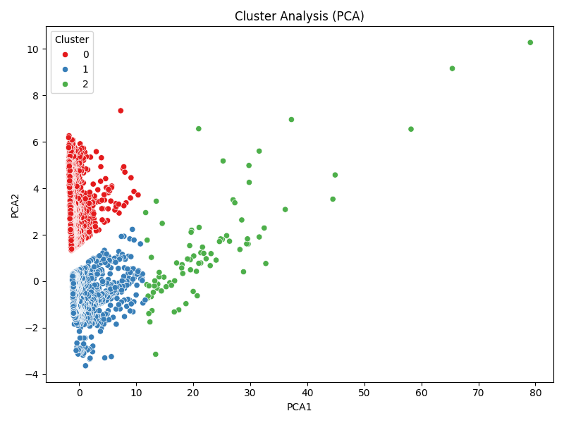

# Dataset Analysis of goodreads.csv

## Dataset Summary
- Shape of the dataset: (10000, 23)
- Columns: book_id, goodreads_book_id, best_book_id, work_id, books_count, isbn, isbn13, authors, original_publication_year, original_title, title, language_code, average_rating, ratings_count, work_ratings_count, work_text_reviews_count, ratings_1, ratings_2, ratings_3, ratings_4, ratings_5, image_url, small_image_url
- Data types:
{'book_id': dtype('int64'), 'goodreads_book_id': dtype('int64'), 'best_book_id': dtype('int64'), 'work_id': dtype('int64'), 'books_count': dtype('int64'), 'isbn': dtype('O'), 'isbn13': dtype('float64'), 'authors': dtype('O'), 'original_publication_year': dtype('float64'), 'original_title': dtype('O'), 'title': dtype('O'), 'language_code': dtype('O'), 'average_rating': dtype('float64'), 'ratings_count': dtype('int64'), 'work_ratings_count': dtype('int64'), 'work_text_reviews_count': dtype('int64'), 'ratings_1': dtype('int64'), 'ratings_2': dtype('int64'), 'ratings_3': dtype('int64'), 'ratings_4': dtype('int64'), 'ratings_5': dtype('int64'), 'image_url': dtype('O'), 'small_image_url': dtype('O')}
- Descriptive statistics:
{'book_id': {'count': 10000.0, 'mean': 5000.5, 'std': 2886.8956799071675, 'min': 1.0, '25%': 2500.75, '50%': 5000.5, '75%': 7500.25, 'max': 10000.0}, 'goodreads_book_id': {'count': 10000.0, 'mean': 5264696.5132, 'std': 7575461.863589611, 'min': 1.0, '25%': 46275.75, '50%': 394965.5, '75%': 9382225.25, 'max': 33288638.0}, 'best_book_id': {'count': 10000.0, 'mean': 5471213.5801, 'std': 7827329.890719961, 'min': 1.0, '25%': 47911.75, '50%': 425123.5, '75%': 9636112.5, 'max': 35534230.0}, 'work_id': {'count': 10000.0, 'mean': 8646183.4246, 'std': 11751060.824080039, 'min': 87.0, '25%': 1008841.0, '50%': 2719524.5, '75%': 14517748.25, 'max': 56399597.0}, 'books_count': {'count': 10000.0, 'mean': 75.7127, 'std': 170.47072765025834, 'min': 1.0, '25%': 23.0, '50%': 40.0, '75%': 67.0, 'max': 3455.0}, 'isbn13': {'count': 10000.0, 'mean': 9755044298883.465, 'std': 429711673677.1295, 'min': 195170342.0, '25%': 9780312306020.0, '50%': 9780446669455.0, '75%': 9780807760637.5, 'max': 9790007672390.0}, 'original_publication_year': {'count': 10000.0, 'mean': 1981.987674115643, 'std': 152.41635943380203, 'min': -1750.0, '25%': 1990.0, '50%': 2004.0, '75%': 2011.0, 'max': 2017.0}, 'average_rating': {'count': 10000.0, 'mean': 4.002191000000001, 'std': 0.25442748053872905, 'min': 2.47, '25%': 3.85, '50%': 4.02, '75%': 4.18, 'max': 4.82}, 'ratings_count': {'count': 10000.0, 'mean': 54001.2351, 'std': 157369.95643554674, 'min': 2716.0, '25%': 13568.75, '50%': 21155.5, '75%': 41053.5, 'max': 4780653.0}, 'work_ratings_count': {'count': 10000.0, 'mean': 59687.3216, 'std': 167803.7852374182, 'min': 5510.0, '25%': 15438.75, '50%': 23832.5, '75%': 45915.0, 'max': 4942365.0}, 'work_text_reviews_count': {'count': 10000.0, 'mean': 2919.9553, 'std': 6124.378131569911, 'min': 3.0, '25%': 694.0, '50%': 1402.0, '75%': 2744.25, 'max': 155254.0}, 'ratings_1': {'count': 10000.0, 'mean': 1345.0406, 'std': 6635.626262783459, 'min': 11.0, '25%': 196.0, '50%': 391.0, '75%': 885.0, 'max': 456191.0}, 'ratings_2': {'count': 10000.0, 'mean': 3110.885, 'std': 9717.123578396993, 'min': 30.0, '25%': 656.0, '50%': 1163.0, '75%': 2353.25, 'max': 436802.0}, 'ratings_3': {'count': 10000.0, 'mean': 11475.8938, 'std': 28546.449183182456, 'min': 323.0, '25%': 3112.0, '50%': 4894.0, '75%': 9287.0, 'max': 793319.0}, 'ratings_4': {'count': 10000.0, 'mean': 19965.6966, 'std': 51447.35838380058, 'min': 750.0, '25%': 5405.75, '50%': 8269.5, '75%': 16023.5, 'max': 1481305.0}, 'ratings_5': {'count': 10000.0, 'mean': 23789.8056, 'std': 79768.88561077163, 'min': 754.0, '25%': 5334.0, '50%': 8836.0, '75%': 17304.5, 'max': 3011543.0}}
- Missing values per column:
{'book_id': 0, 'goodreads_book_id': 0, 'best_book_id': 0, 'work_id': 0, 'books_count': 0, 'isbn': 0, 'isbn13': 0, 'authors': 0, 'original_publication_year': 0, 'original_title': 0, 'title': 0, 'language_code': 0, 'average_rating': 0, 'ratings_count': 0, 'work_ratings_count': 0, 'work_text_reviews_count': 0, 'ratings_1': 0, 'ratings_2': 0, 'ratings_3': 0, 'ratings_4': 0, 'ratings_5': 0, 'image_url': 0, 'small_image_url': 0}

## Outlier Detection
Outliers detected in each numeric column (Z-score > 3):
{'book_id': 0, 'goodreads_book_id': 78, 'best_book_id': 87, 'work_id': 254, 'books_count': 178, 'isbn13': 33, 'original_publication_year': 53, 'average_rating': 72, 'ratings_count': 108, 'work_ratings_count': 119, 'work_text_reviews_count': 151, 'ratings_1': 73, 'ratings_2': 121, 'ratings_3': 135, 'ratings_4': 134, 'ratings_5': 108}

## Correlation Analysis
Correlation Matrix:
{'book_id': {'book_id': 1.0, 'goodreads_book_id': 0.1151542250729873, 'best_book_id': 0.10451581042885268, 'work_id': 0.11386077336475141, 'books_count': -0.2638407143748987, 'isbn13': -0.010956676032027608, 'original_publication_year': 0.04982568767273949, 'average_rating': -0.04087978276976166, 'ratings_count': -0.37317805088282024, 'work_ratings_count': -0.38265644900402224, 'work_text_reviews_count': -0.4192924520469794, 'ratings_1': -0.23940143054993687, 'ratings_2': -0.34576390293162224, 'ratings_3': -0.41327940995578105, 'ratings_4': -0.407078870043465, 'ratings_5': -0.33248551987800284}, 'goodreads_book_id': {'book_id': 0.1151542250729873, 'goodreads_book_id': 1.0, 'best_book_id': 0.9666202280510783, 'work_id': 0.9293557951065965, 'books_count': -0.1645781132281244, 'isbn13': -0.043611809855720725, 'original_publication_year': 0.13373024898382466, 'average_rating': -0.024848366694833045, 'ratings_count': -0.07302296072682894, 'work_ratings_count': -0.06376009930046676, 'work_text_reviews_count': 0.11884477199004521, 'ratings_1': -0.03837517827163446, 'ratings_2': -0.05657115661164492, 'ratings_3': -0.07563401403101903, 'ratings_4': -0.06331040494862238, 'ratings_5': -0.05614467450588117}, 'best_book_id': {'book_id': 0.10451581042885268, 'goodreads_book_id': 0.9666202280510783, 'best_book_id': 1.0, 'work_id': 0.899258347865944, 'books_count': -0.15923978629895047, 'isbn13': -0.042681105929351155, 'original_publication_year': 0.13138624338911686, 'average_rating': -0.021186976943576245, 'ratings_count': -0.06918188865834952, 'work_ratings_count': -0.05583462320172786, 'work_text_reviews_count': 0.12589277062401424, 'ratings_1': -0.033893810676640795, 'ratings_2': -0.049284209763921276, 'ratings_3': -0.06701410382837872, 'ratings_4': -0.05446200723576491, 'ratings_5': -0.04952448011831339}, 'work_id': {'book_id': 0.11386077336475141, 'goodreads_book_id': 0.9293557951065965, 'best_book_id': 0.899258347865944, 'work_id': 1.0, 'books_count': -0.10943559449223915, 'isbn13': -0.03548685971458707, 'original_publication_year': 0.10786286028775056, 'average_rating': -0.017555424736745106, 'ratings_count': -0.06272043125204012, 'work_ratings_count': -0.05471209877738029, 'work_text_reviews_count': 0.09698531520142002, 'ratings_1': -0.034590254483539334, 'ratings_2': -0.051366817603748526, 'ratings_3': -0.06674590238429455, 'ratings_4': -0.05477538394045195, 'ratings_5': -0.046745347013583224}, 'books_count': {'book_id': -0.2638407143748987, 'goodreads_book_id': -0.1645781132281244, 'best_book_id': -0.15923978629895047, 'work_id': -0.10943559449223915, 'books_count': 1.0, 'isbn13': 0.01730382731040218, 'original_publication_year': -0.3217166478439057, 'average_rating': -0.06988827020098386, 'ratings_count': 0.3242348400810117, 'work_ratings_count': 0.33366387680574255, 'work_text_reviews_count': 0.19869788167736252, 'ratings_1': 0.22576273903712912, 'ratings_2': 0.3349232577047334, 'ratings_3': 0.38369948855820096, 'ratings_4': 0.34956406578445615, 'ratings_5': 0.27955872502528073}, 'isbn13': {'book_id': -0.010956676032027608, 'goodreads_book_id': -0.043611809855720725, 'best_book_id': -0.042681105929351155, 'work_id': -0.03548685971458707, 'books_count': 0.01730382731040218, 'isbn13': 1.0, 'original_publication_year': -0.004577502914546753, 'average_rating': -0.024907015118456517, 'ratings_count': 0.008873687014246531, 'work_ratings_count': 0.00913209075550266, 'work_text_reviews_count': 0.009441975103007908, 'ratings_1': 0.006041745335893893, 'ratings_2': 0.010308641618760349, 'ratings_3': 0.012083863589731642, 'ratings_4': 0.010116230434059618, 'ratings_5': 0.006603245774065251}, 'original_publication_year': {'book_id': 0.04982568767273949, 'goodreads_book_id': 0.13373024898382466, 'best_book_id': 0.13138624338911686, 'work_id': 0.10786286028775056, 'books_count': -0.3217166478439057, 'isbn13': -0.004577502914546753, 'original_publication_year': 1.0, 'average_rating': 0.015578763863203397, 'ratings_count': -0.02441042179669036, 'work_ratings_count': -0.02544366634688894, 'work_text_reviews_count': 0.02777905915897205, 'ratings_1': -0.019633873951222864, 'ratings_2': -0.038467927920914004, 'ratings_3': -0.04245186887261952, 'ratings_4': -0.025781407671455585, 'ratings_5': -0.015384788408041744}, 'average_rating': {'book_id': -0.04087978276976166, 'goodreads_book_id': -0.024848366694833045, 'best_book_id': -0.021186976943576245, 'work_id': -0.017555424736745106, 'books_count': -0.06988827020098386, 'isbn13': -0.024907015118456517, 'original_publication_year': 0.015578763863203397, 'average_rating': 1.0, 'ratings_count': 0.044990392631164666, 'work_ratings_count': 0.045041585239413644, 'work_text_reviews_count': 0.007481118668807443, 'ratings_1': -0.07799662415522204, 'ratings_2': -0.11587493746995214, 'ratings_3': -0.06523721099791854, 'ratings_4': 0.03610823293618192, 'ratings_5': 0.11541208691328027}, 'ratings_count': {'book_id': -0.37317805088282024, 'goodreads_book_id': -0.07302296072682894, 'best_book_id': -0.06918188865834952, 'work_id': -0.06272043125204012, 'books_count': 0.3242348400810117, 'isbn13': 0.008873687014246531, 'original_publication_year': -0.02441042179669036, 'average_rating': 0.044990392631164666, 'ratings_count': 1.0, 'work_ratings_count': 0.9950684522356626, 'work_text_reviews_count': 0.7796353168906955, 'ratings_1': 0.7231441619049627, 'ratings_2': 0.8459485246688129, 'ratings_3': 0.9351934053602183, 'ratings_4': 0.9788692684580528, 'ratings_5': 0.9640458485933925}, 'work_ratings_count': {'book_id': -0.38265644900402224, 'goodreads_book_id': -0.06376009930046676, 'best_book_id': -0.05583462320172786, 'work_id': -0.05471209877738029, 'books_count': 0.33366387680574255, 'isbn13': 0.00913209075550266, 'original_publication_year': -0.02544366634688894, 'average_rating': 0.045041585239413644, 'ratings_count': 0.9950684522356626, 'work_ratings_count': 1.0, 'work_text_reviews_count': 0.8070090183152882, 'ratings_1': 0.7187183512028753, 'ratings_2': 0.8485810158231092, 'ratings_3': 0.9411824055564031, 'ratings_4': 0.9877642872458879, 'ratings_5': 0.9665873189308573}, 'work_text_reviews_count': {'book_id': -0.4192924520469794, 'goodreads_book_id': 0.11884477199004521, 'best_book_id': 0.12589277062401424, 'work_id': 0.09698531520142002, 'books_count': 0.19869788167736252, 'isbn13': 0.009441975103007908, 'original_publication_year': 0.02777905915897205, 'average_rating': 0.007481118668807443, 'ratings_count': 0.7796353168906955, 'work_ratings_count': 0.8070090183152882, 'work_text_reviews_count': 1.0, 'ratings_1': 0.5720071017104471, 'ratings_2': 0.6968802649438623, 'ratings_3': 0.762214166706411, 'ratings_4': 0.8178258148008882, 'ratings_5': 0.7649396724079743}, 'ratings_1': {'book_id': -0.23940143054993687, 'goodreads_book_id': -0.03837517827163446, 'best_book_id': -0.033893810676640795, 'work_id': -0.034590254483539334, 'books_count': 0.22576273903712912, 'isbn13': 0.006041745335893893, 'original_publication_year': -0.019633873951222864, 'average_rating': -0.07799662415522204, 'ratings_count': 0.7231441619049627, 'work_ratings_count': 0.7187183512028753, 'work_text_reviews_count': 0.5720071017104471, 'ratings_1': 1.0, 'ratings_2': 0.9261401860414354, 'ratings_3': 0.7953640691170768, 'ratings_4': 0.6729856038240589, 'ratings_5': 0.5972311516820766}, 'ratings_2': {'book_id': -0.34576390293162224, 'goodreads_book_id': -0.05657115661164492, 'best_book_id': -0.049284209763921276, 'work_id': -0.051366817603748526, 'books_count': 0.3349232577047334, 'isbn13': 0.010308641618760349, 'original_publication_year': -0.038467927920914004, 'average_rating': -0.11587493746995214, 'ratings_count': 0.8459485246688129, 'work_ratings_count': 0.8485810158231092, 'work_text_reviews_count': 0.6968802649438623, 'ratings_1': 0.9261401860414354, 'ratings_2': 1.0, 'ratings_3': 0.9495959703558788, 'ratings_4': 0.8382981781852077, 'ratings_5': 0.7057468894904011}, 'ratings_3': {'book_id': -0.41327940995578105, 'goodreads_book_id': -0.07563401403101903, 'best_book_id': -0.06701410382837872, 'work_id': -0.06674590238429455, 'books_count': 0.38369948855820096, 'isbn13': 0.012083863589731642, 'original_publication_year': -0.04245186887261952, 'average_rating': -0.06523721099791854, 'ratings_count': 0.9351934053602183, 'work_ratings_count': 0.9411824055564031, 'work_text_reviews_count': 0.762214166706411, 'ratings_1': 0.7953640691170768, 'ratings_2': 0.9495959703558788, 'ratings_3': 1.0, 'ratings_4': 0.9529981100422881, 'ratings_5': 0.825550026910667}, 'ratings_4': {'book_id': -0.407078870043465, 'goodreads_book_id': -0.06331040494862238, 'best_book_id': -0.05446200723576491, 'work_id': -0.05477538394045195, 'books_count': 0.34956406578445615, 'isbn13': 0.010116230434059618, 'original_publication_year': -0.025781407671455585, 'average_rating': 0.03610823293618192, 'ratings_count': 0.9788692684580528, 'work_ratings_count': 0.9877642872458879, 'work_text_reviews_count': 0.8178258148008882, 'ratings_1': 0.6729856038240589, 'ratings_2': 0.8382981781852077, 'ratings_3': 0.9529981100422881, 'ratings_4': 1.0, 'ratings_5': 0.933784987816964}, 'ratings_5': {'book_id': -0.33248551987800284, 'goodreads_book_id': -0.05614467450588117, 'best_book_id': -0.04952448011831339, 'work_id': -0.046745347013583224, 'books_count': 0.27955872502528073, 'isbn13': 0.006603245774065251, 'original_publication_year': -0.015384788408041744, 'average_rating': 0.11541208691328027, 'ratings_count': 0.9640458485933925, 'work_ratings_count': 0.9665873189308573, 'work_text_reviews_count': 0.7649396724079743, 'ratings_1': 0.5972311516820766, 'ratings_2': 0.7057468894904011, 'ratings_3': 0.825550026910667, 'ratings_4': 0.933784987816964, 'ratings_5': 1.0}}

## Dataset Analysis Story
**A Journey through the World of Books: Analyzing a Rich Dataset**

In a digital landscape bursting with narratives, characters, and thought-provoking ideas, 10,000 unique books have been captured in a transformative dataset. This dataset is not merely a collection of titles, authors, and ratings; it is a treasure trove of insights waiting to be unravelled. As we embark on this analytical journey, we will dissect the underlying themes, correlations, and anomalies that this data reveals about the literary world.

#### Unveiling the Shape and Structure
The dataset is robust, comprising 10,000 rows and 23 columns, each denoting critical elements of a book's identity. From `book_id` to `average_rating`, these variables allow us to capture the essence of each book, its reception, and its journey through time. The data types indicate a mixture of numerical and categorical variables, hinting at diverse analyses we might conduct.

Delving into the descriptive statistics, the dataset's mean average rating sits comfortably at **4.00**, a testament to the quality readership seems to expect from this collection. The spread of ratings—from a minimum of **2.47** to a maximum of **4.82**—indicates that while there are commendable reads, a few books fall short of expectations.

#### Titles that Transcend Time
Examining the `original_publication_year`, we find a mean year of **1981**, with a surprisingly wide standard deviation of **152.42**. This standard deviation hints at the presence of classic literature alongside contemporary works. The oldest works date back to **-1750**, which might include timeless classics or early historical writings. Meanwhile, the latest works reach up to **2017**, representing both modern narratives and emerging authors.

An interesting exploration into the `books_count` reveals the typical author has written around **76** books, with a significant maximum of **3455**. This raises questions: do prolific authors maintain the quality of their works across such a voluminous output? It would be compelling to compare the average ratings of top authors against those who write fewer books.

#### Uncommon Connections: Diving into Correlation
As we venture into the correlation matrix, a tapestry of relationships between different features unfolds. The strongest correlation exists between `ratings_count` and `work_ratings_count`, signifying that books frequently reviewed are likely to accumulate ratings. However, a stronger negative correlation between `ratings_count` and `average_rating` suggests that as a book garners more ratings, its average score tends to dip slightly—a phenomenon common when a popular title faces overwhelming critique.

Curiously, the `original_publication_year` shows a notable negative correlation with several rating categories. This could imply that older works are perceived with nostalgia but might not resonate with contemporary audiences as strongly.

#### Outliers: Books that Buck the Trend
Within this wealth of data lies a handful of outliers that provoke curiosity. Books identified as outliers in various rating categories exhibit extreme values, raising questions about their reception. For instance, a `goodreads_book_id` with an unusual rating might signal a beloved classic that has received polarizing opinions. Investigating these entries could reveal insightful anecdotes about literary preferences and community sentiments. 

#### Recommendations for Further Analysis
The analysis thus far evokes several intriguing questions for further research:
1. **Author Analysis**: Understanding the relationship between the number of books by an author and their average ratings could provide critical insights into quality vs. quantity in literature.
2. **Temporal Trends**: A deeper exploration into how book ratings have changed over time would highlight shifts in literary tastes and the impacts of digital platforms and social media on book reviews.
3. **Genre Investigations**: Segmenting the dataset by genre (though not directly included) can reveal hidden trends and correlations specific to types of literature.

The narratives of these books beckon a deeper dive. Every author, title, and rating contributes to a broader story—one of tastes, trends, and timelessness. As we conclude our initial exploration, one thing is clear: this dataset is a rich foundation upon which to build further insights and understanding of the literary world, capturing the ongoing dialogue between books, readers, and the cultural zeitgeist.

## Visualizations

