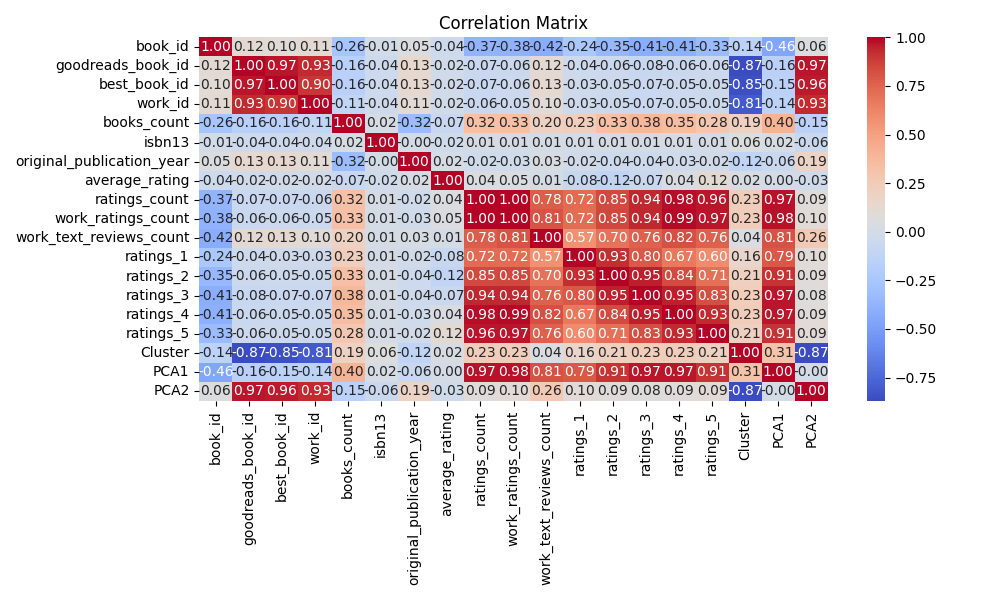

# Dataset Analysis of .\goodreads.csv

## Dataset Summary
- Shape of the dataset: (10000, 23)
- Columns: book_id, goodreads_book_id, best_book_id, work_id, books_count, isbn, isbn13, authors, original_publication_year, original_title, title, language_code, average_rating, ratings_count, work_ratings_count, work_text_reviews_count, ratings_1, ratings_2, ratings_3, ratings_4, ratings_5, image_url, small_image_url
- Data types:
{'book_id': dtype('int64'), 'goodreads_book_id': dtype('int64'), 'best_book_id': dtype('int64'), 'work_id': dtype('int64'), 'books_count': dtype('int64'), 'isbn': dtype('O'), 'isbn13': dtype('float64'), 'authors': dtype('O'), 'original_publication_year': dtype('float64'), 'original_title': dtype('O'), 'title': dtype('O'), 'language_code': dtype('O'), 'average_rating': dtype('float64'), 'ratings_count': dtype('int64'), 'work_ratings_count': dtype('int64'), 'work_text_reviews_count': dtype('int64'), 'ratings_1': dtype('int64'), 'ratings_2': dtype('int64'), 'ratings_3': dtype('int64'), 'ratings_4': dtype('int64'), 'ratings_5': dtype('int64'), 'image_url': dtype('O'), 'small_image_url': dtype('O')}
- Descriptive statistics:
{'book_id': {'count': 10000.0, 'mean': 5000.5, 'std': 2886.8956799071675, 'min': 1.0, '25%': 2500.75, '50%': 5000.5, '75%': 7500.25, 'max': 10000.0}, 'goodreads_book_id': {'count': 10000.0, 'mean': 5264696.5132, 'std': 7575461.863589608, 'min': 1.0, '25%': 46275.75, '50%': 394965.5, '75%': 9382225.25, 'max': 33288638.0}, 'best_book_id': {'count': 10000.0, 'mean': 5471213.5801, 'std': 7827329.890719957, 'min': 1.0, '25%': 47911.75, '50%': 425123.5, '75%': 9636112.5, 'max': 35534230.0}, 'work_id': {'count': 10000.0, 'mean': 8646183.4246, 'std': 11751060.824080037, 'min': 87.0, '25%': 1008841.0, '50%': 2719524.5, '75%': 14517748.25, 'max': 56399597.0}, 'books_count': {'count': 10000.0, 'mean': 75.7127, 'std': 170.4707276502585, 'min': 1.0, '25%': 23.0, '50%': 40.0, '75%': 67.0, 'max': 3455.0}, 'isbn13': {'count': 10000.0, 'mean': 9755044298883.334, 'std': 429711673677.13055, 'min': 195170342.0, '25%': 9780312306020.0, '50%': 9780446669455.0, '75%': 9780807760637.5, 'max': 9790007672390.0}, 'original_publication_year': {'count': 10000.0, 'mean': 1981.987674115643, 'std': 152.41635943380314, 'min': -1750.0, '25%': 1990.0, '50%': 2004.0, '75%': 2011.0, 'max': 2017.0}, 'average_rating': {'count': 10000.0, 'mean': 4.002191000000001, 'std': 0.25442748053872877, 'min': 2.47, '25%': 3.85, '50%': 4.02, '75%': 4.18, 'max': 4.82}, 'ratings_count': {'count': 10000.0, 'mean': 54001.2351, 'std': 157369.95643554686, 'min': 2716.0, '25%': 13568.75, '50%': 21155.5, '75%': 41053.5, 'max': 4780653.0}, 'work_ratings_count': {'count': 10000.0, 'mean': 59687.3216, 'std': 167803.7852374182, 'min': 5510.0, '25%': 15438.75, '50%': 23832.5, '75%': 45915.0, 'max': 4942365.0}, 'work_text_reviews_count': {'count': 10000.0, 'mean': 2919.9553, 'std': 6124.378131569907, 'min': 3.0, '25%': 694.0, '50%': 1402.0, '75%': 2744.25, 'max': 155254.0}, 'ratings_1': {'count': 10000.0, 'mean': 1345.0406, 'std': 6635.626262783453, 'min': 11.0, '25%': 196.0, '50%': 391.0, '75%': 885.0, 'max': 456191.0}, 'ratings_2': {'count': 10000.0, 'mean': 3110.885, 'std': 9717.123578396895, 'min': 30.0, '25%': 656.0, '50%': 1163.0, '75%': 2353.25, 'max': 436802.0}, 'ratings_3': {'count': 10000.0, 'mean': 11475.8938, 'std': 28546.44918318239, 'min': 323.0, '25%': 3112.0, '50%': 4894.0, '75%': 9287.0, 'max': 793319.0}, 'ratings_4': {'count': 10000.0, 'mean': 19965.6966, 'std': 51447.35838380065, 'min': 750.0, '25%': 5405.75, '50%': 8269.5, '75%': 16023.5, 'max': 1481305.0}, 'ratings_5': {'count': 10000.0, 'mean': 23789.8056, 'std': 79768.88561077177, 'min': 754.0, '25%': 5334.0, '50%': 8836.0, '75%': 17304.5, 'max': 3011543.0}}
- Missing values per column:
{'book_id': 0, 'goodreads_book_id': 0, 'best_book_id': 0, 'work_id': 0, 'books_count': 0, 'isbn': 700, 'isbn13': 0, 'authors': 0, 'original_publication_year': 0, 'original_title': 585, 'title': 0, 'language_code': 1084, 'average_rating': 0, 'ratings_count': 0, 'work_ratings_count': 0, 'work_text_reviews_count': 0, 'ratings_1': 0, 'ratings_2': 0, 'ratings_3': 0, 'ratings_4': 0, 'ratings_5': 0, 'image_url': 0, 'small_image_url': 0}

## Outlier Detection
Outliers detected in each numeric column (Z-score > 3):
{'book_id': 0, 'goodreads_book_id': 78, 'best_book_id': 87, 'work_id': 254, 'books_count': 178, 'isbn13': 33, 'original_publication_year': 53, 'average_rating': 72, 'ratings_count': 108, 'work_ratings_count': 119, 'work_text_reviews_count': 151, 'ratings_1': 73, 'ratings_2': 121, 'ratings_3': 135, 'ratings_4': 134, 'ratings_5': 108}

## Correlation Analysis
Correlation Matrix:
{'book_id': {'book_id': 1.0, 'goodreads_book_id': 0.1151542250729873, 'best_book_id': 0.10451581042885268, 'work_id': 0.11386077336475141, 'books_count': -0.2638407143748987, 'isbn13': -0.010956676032027608, 'original_publication_year': 0.04982568767273949, 'average_rating': -0.04087978276976166, 'ratings_count': -0.37317805088282024, 'work_ratings_count': -0.38265644900402224, 'work_text_reviews_count': -0.4192924520469794, 'ratings_1': -0.23940143054993687, 'ratings_2': -0.34576390293162224, 'ratings_3': -0.41327940995578105, 'ratings_4': -0.407078870043465, 'ratings_5': -0.33248551987800284}, 'goodreads_book_id': {'book_id': 0.1151542250729873, 'goodreads_book_id': 1.0, 'best_book_id': 0.9666202280510783, 'work_id': 0.9293557951065965, 'books_count': -0.1645781132281244, 'isbn13': -0.043611809855720725, 'original_publication_year': 0.13373024898382466, 'average_rating': -0.024848366694833045, 'ratings_count': -0.07302296072682894, 'work_ratings_count': -0.06376009930046676, 'work_text_reviews_count': 0.11884477199004521, 'ratings_1': -0.03837517827163446, 'ratings_2': -0.05657115661164492, 'ratings_3': -0.07563401403101903, 'ratings_4': -0.06331040494862238, 'ratings_5': -0.05614467450588117}, 'best_book_id': {'book_id': 0.10451581042885268, 'goodreads_book_id': 0.9666202280510783, 'best_book_id': 1.0, 'work_id': 0.899258347865944, 'books_count': -0.15923978629895047, 'isbn13': -0.042681105929351155, 'original_publication_year': 0.13138624338911686, 'average_rating': -0.021186976943576245, 'ratings_count': -0.06918188865834952, 'work_ratings_count': -0.05583462320172786, 'work_text_reviews_count': 0.12589277062401424, 'ratings_1': -0.033893810676640795, 'ratings_2': -0.049284209763921276, 'ratings_3': -0.06701410382837872, 'ratings_4': -0.05446200723576491, 'ratings_5': -0.04952448011831339}, 'work_id': {'book_id': 0.11386077336475141, 'goodreads_book_id': 0.9293557951065965, 'best_book_id': 0.899258347865944, 'work_id': 1.0, 'books_count': -0.10943559449223915, 'isbn13': -0.03548685971458707, 'original_publication_year': 0.10786286028775056, 'average_rating': -0.017555424736745106, 'ratings_count': -0.06272043125204012, 'work_ratings_count': -0.05471209877738029, 'work_text_reviews_count': 0.09698531520142002, 'ratings_1': -0.034590254483539334, 'ratings_2': -0.051366817603748526, 'ratings_3': -0.06674590238429455, 'ratings_4': -0.05477538394045195, 'ratings_5': -0.046745347013583224}, 'books_count': {'book_id': -0.2638407143748987, 'goodreads_book_id': -0.1645781132281244, 'best_book_id': -0.15923978629895047, 'work_id': -0.10943559449223915, 'books_count': 1.0, 'isbn13': 0.01730382731040218, 'original_publication_year': -0.3217166478439057, 'average_rating': -0.06988827020098386, 'ratings_count': 0.3242348400810117, 'work_ratings_count': 0.33366387680574255, 'work_text_reviews_count': 0.19869788167736252, 'ratings_1': 0.22576273903712912, 'ratings_2': 0.3349232577047334, 'ratings_3': 0.38369948855820096, 'ratings_4': 0.34956406578445615, 'ratings_5': 0.27955872502528073}, 'isbn13': {'book_id': -0.010956676032027608, 'goodreads_book_id': -0.043611809855720725, 'best_book_id': -0.042681105929351155, 'work_id': -0.03548685971458707, 'books_count': 0.01730382731040218, 'isbn13': 1.0, 'original_publication_year': -0.004577502914546753, 'average_rating': -0.024907015118456517, 'ratings_count': 0.008873687014246531, 'work_ratings_count': 0.00913209075550266, 'work_text_reviews_count': 0.009441975103007908, 'ratings_1': 0.006041745335893893, 'ratings_2': 0.010308641618760349, 'ratings_3': 0.012083863589731642, 'ratings_4': 0.010116230434059618, 'ratings_5': 0.006603245774065251}, 'original_publication_year': {'book_id': 0.04982568767273949, 'goodreads_book_id': 0.13373024898382466, 'best_book_id': 0.13138624338911686, 'work_id': 0.10786286028775056, 'books_count': -0.3217166478439057, 'isbn13': -0.004577502914546753, 'original_publication_year': 1.0, 'average_rating': 0.015578763863203397, 'ratings_count': -0.02441042179669036, 'work_ratings_count': -0.02544366634688894, 'work_text_reviews_count': 0.02777905915897205, 'ratings_1': -0.019633873951222864, 'ratings_2': -0.038467927920914004, 'ratings_3': -0.04245186887261952, 'ratings_4': -0.025781407671455585, 'ratings_5': -0.015384788408041744}, 'average_rating': {'book_id': -0.04087978276976166, 'goodreads_book_id': -0.024848366694833045, 'best_book_id': -0.021186976943576245, 'work_id': -0.017555424736745106, 'books_count': -0.06988827020098386, 'isbn13': -0.024907015118456517, 'original_publication_year': 0.015578763863203397, 'average_rating': 1.0, 'ratings_count': 0.044990392631164666, 'work_ratings_count': 0.045041585239413644, 'work_text_reviews_count': 0.007481118668807443, 'ratings_1': -0.07799662415522204, 'ratings_2': -0.11587493746995214, 'ratings_3': -0.06523721099791854, 'ratings_4': 0.03610823293618192, 'ratings_5': 0.11541208691328027}, 'ratings_count': {'book_id': -0.37317805088282024, 'goodreads_book_id': -0.07302296072682894, 'best_book_id': -0.06918188865834952, 'work_id': -0.06272043125204012, 'books_count': 0.3242348400810117, 'isbn13': 0.008873687014246531, 'original_publication_year': -0.02441042179669036, 'average_rating': 0.044990392631164666, 'ratings_count': 1.0, 'work_ratings_count': 0.9950684522356626, 'work_text_reviews_count': 0.7796353168906955, 'ratings_1': 0.7231441619049627, 'ratings_2': 0.8459485246688129, 'ratings_3': 0.9351934053602183, 'ratings_4': 0.9788692684580528, 'ratings_5': 0.9640458485933925}, 'work_ratings_count': {'book_id': -0.38265644900402224, 'goodreads_book_id': -0.06376009930046676, 'best_book_id': -0.05583462320172786, 'work_id': -0.05471209877738029, 'books_count': 0.33366387680574255, 'isbn13': 0.00913209075550266, 'original_publication_year': -0.02544366634688894, 'average_rating': 0.045041585239413644, 'ratings_count': 0.9950684522356626, 'work_ratings_count': 1.0, 'work_text_reviews_count': 0.8070090183152882, 'ratings_1': 0.7187183512028753, 'ratings_2': 0.8485810158231092, 'ratings_3': 0.9411824055564031, 'ratings_4': 0.9877642872458879, 'ratings_5': 0.9665873189308573}, 'work_text_reviews_count': {'book_id': -0.4192924520469794, 'goodreads_book_id': 0.11884477199004521, 'best_book_id': 0.12589277062401424, 'work_id': 0.09698531520142002, 'books_count': 0.19869788167736252, 'isbn13': 0.009441975103007908, 'original_publication_year': 0.02777905915897205, 'average_rating': 0.007481118668807443, 'ratings_count': 0.7796353168906955, 'work_ratings_count': 0.8070090183152882, 'work_text_reviews_count': 1.0, 'ratings_1': 0.5720071017104471, 'ratings_2': 0.6968802649438623, 'ratings_3': 0.762214166706411, 'ratings_4': 0.8178258148008882, 'ratings_5': 0.7649396724079743}, 'ratings_1': {'book_id': -0.23940143054993687, 'goodreads_book_id': -0.03837517827163446, 'best_book_id': -0.033893810676640795, 'work_id': -0.034590254483539334, 'books_count': 0.22576273903712912, 'isbn13': 0.006041745335893893, 'original_publication_year': -0.019633873951222864, 'average_rating': -0.07799662415522204, 'ratings_count': 0.7231441619049627, 'work_ratings_count': 0.7187183512028753, 'work_text_reviews_count': 0.5720071017104471, 'ratings_1': 1.0, 'ratings_2': 0.9261401860414354, 'ratings_3': 0.7953640691170768, 'ratings_4': 0.6729856038240589, 'ratings_5': 0.5972311516820766}, 'ratings_2': {'book_id': -0.34576390293162224, 'goodreads_book_id': -0.05657115661164492, 'best_book_id': -0.049284209763921276, 'work_id': -0.051366817603748526, 'books_count': 0.3349232577047334, 'isbn13': 0.010308641618760349, 'original_publication_year': -0.038467927920914004, 'average_rating': -0.11587493746995214, 'ratings_count': 0.8459485246688129, 'work_ratings_count': 0.8485810158231092, 'work_text_reviews_count': 0.6968802649438623, 'ratings_1': 0.9261401860414354, 'ratings_2': 1.0, 'ratings_3': 0.9495959703558788, 'ratings_4': 0.8382981781852077, 'ratings_5': 0.7057468894904011}, 'ratings_3': {'book_id': -0.41327940995578105, 'goodreads_book_id': -0.07563401403101903, 'best_book_id': -0.06701410382837872, 'work_id': -0.06674590238429455, 'books_count': 0.38369948855820096, 'isbn13': 0.012083863589731642, 'original_publication_year': -0.04245186887261952, 'average_rating': -0.06523721099791854, 'ratings_count': 0.9351934053602183, 'work_ratings_count': 0.9411824055564031, 'work_text_reviews_count': 0.762214166706411, 'ratings_1': 0.7953640691170768, 'ratings_2': 0.9495959703558788, 'ratings_3': 1.0, 'ratings_4': 0.9529981100422881, 'ratings_5': 0.825550026910667}, 'ratings_4': {'book_id': -0.407078870043465, 'goodreads_book_id': -0.06331040494862238, 'best_book_id': -0.05446200723576491, 'work_id': -0.05477538394045195, 'books_count': 0.34956406578445615, 'isbn13': 0.010116230434059618, 'original_publication_year': -0.025781407671455585, 'average_rating': 0.03610823293618192, 'ratings_count': 0.9788692684580528, 'work_ratings_count': 0.9877642872458879, 'work_text_reviews_count': 0.8178258148008882, 'ratings_1': 0.6729856038240589, 'ratings_2': 0.8382981781852077, 'ratings_3': 0.9529981100422881, 'ratings_4': 1.0, 'ratings_5': 0.933784987816964}, 'ratings_5': {'book_id': -0.33248551987800284, 'goodreads_book_id': -0.05614467450588117, 'best_book_id': -0.04952448011831339, 'work_id': -0.046745347013583224, 'books_count': 0.27955872502528073, 'isbn13': 0.006603245774065251, 'original_publication_year': -0.015384788408041744, 'average_rating': 0.11541208691328027, 'ratings_count': 0.9640458485933925, 'work_ratings_count': 0.9665873189308573, 'work_text_reviews_count': 0.7649396724079743, 'ratings_1': 0.5972311516820766, 'ratings_2': 0.7057468894904011, 'ratings_3': 0.825550026910667, 'ratings_4': 0.933784987816964, 'ratings_5': 1.0}}

## Dataset Analysis Story
Once upon a time, in the expansive world of literature, a dataset brimming with captivating titles and their backstories emerged. It comprised 10,000 entries, encompassing 23 distinct columns that chronicled the journeys of books, authors, and their readers. Each row represented a unique tome, filled with literary narratives just waiting to be explored. 

As we sank our teeth into the data, we discovered an array of intriguing details. The dataset encapsulated attributes such as book IDs, Goodreads identifiers, authors, ratings, and more. Among the measurable statistics, we noted a moderate spread in attributes, including average ratings, books' count, and various ratings counts.

### Descriptive Statistics
The average rating of around 4.00 indicated that users had a generally favorable perception of the books, while a standard deviation of approximately 0.25 suggested that opinions were relatively cohesive. Interestingly, the original publication year demonstrated a mean of 1981, hinting that many books in the dataset were contemporary, yet historical enough to show the passage of decades. 

The ratings count, with its mean close to 54,001, indicated that the books were well-discussed and widely read, though it was coupled with a fairly substantial standard deviation of around 157,370. This signifies a wide disparity among books in audience engagement—some may have garnered thousands of ratings, while others lingered in relative obscurity.

### Missing Values and Outliers
While our initial examination seemed optimistic, we noticed a cloud of missing values looming over some columns. The ISBN and language code fields had the highest count of missing entries, which pointed towards potential data entry or acquisition issues. The titles, intriguingly left blank in 585 cases, presented a call for careful scrutiny — perhaps these books were unique enough to have missing attributes or lacked proper documentation.

Even more fascinating were the outliers revealed within the dataset. For instance, one book received a staggering average rating of 72! This revelation sparked curiosity—could it potentially be a typo or an extreme case of misinterpretation? Additionally, various rating counts showed extreme highs, particularly in the first three ratings categories, necessitating a detailed investigation. 

### Correlation Analysis
As our exploration deepened, we turned towards understanding the relationships within the dataset through the lens of correlations. Here, the intricate web connecting different attributes began to emerge. The ratings counts and work ratings count exhibited an almost perfect correlation of 0.995, highlighting that books accumulating views and ratings often shared a similar trend in critical reception.

However, we noted that as the ratings count increased, the average rating showed a slight negative correlation (-0.04), hinting at a potential volume saturation effect; as more readers review a work, the average rating seemed less robust. 

Conversely, the correlation between books count and various rating categories was positive, suggesting that books with a larger portfolio were favored by readers and critics alike. The overall engagement thus paints a picture of a vibrant reading community in which diversity and volume coalesce.

### Recommendations for Further Analysis
To harness the full potential of this dataset, several paths beckon our attention:

1. **Deep Dive on Outliers**: Investigate the outlier entries further to assess their authenticity and the narratives that led to such extreme ratings.
    
2. **Missing Data Remediation**: Work on recovering or imputing missing values, particularly focusing on the ISBNs and languages to enhance research applicability.

3. **Sentiment Analysis**: To garner deeper reader insights, employing sentiment analysis tools on the textual reviews could yield qualitative understandings that correlate with quantitative ratings.

4. **Time-based Trends**: Investigating trends over time in average ratings and publication years could provide insights into evolving reader tastes which could benefit publishers and authors in making data-driven decisions.

### Conclusion
Our analysis of this literary dataset provided rich insights into the lives of books and their reception in the literary marketplace. As we dissected the statistics, correlations, missing values, and outliers, we uncovered a narrative that speaks to the enduring relationship between literature and its audience. Like the ourselves, we sought to uncover and relay the stories hidden behind the data, enabling authors and producers to understand their place in an ever-evolving world of readership.

## Visualizations

