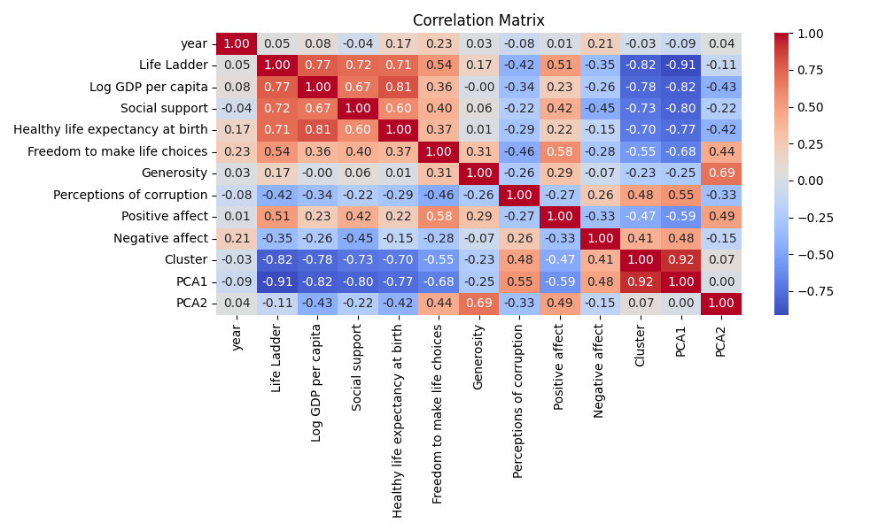

# Dataset Analysis of .\happiness.csv

## Dataset Summary
- Shape of the dataset: (2363, 11)
- Columns: Country name, year, Life Ladder, Log GDP per capita, Social support, Healthy life expectancy at birth, Freedom to make life choices, Generosity, Perceptions of corruption, Positive affect, Negative affect
- Data types:
{'Country name': dtype('O'), 'year': dtype('int64'), 'Life Ladder': dtype('float64'), 'Log GDP per capita': dtype('float64'), 'Social support': dtype('float64'), 'Healthy life expectancy at birth': dtype('float64'), 'Freedom to make life choices': dtype('float64'), 'Generosity': dtype('float64'), 'Perceptions of corruption': dtype('float64'), 'Positive affect': dtype('float64'), 'Negative affect': dtype('float64')}
- Descriptive statistics:
{'year': {'count': 2363.0, 'mean': 2014.7638595006347, 'std': 5.059436468192803, 'min': 2005.0, '25%': 2011.0, '50%': 2015.0, '75%': 2019.0, 'max': 2023.0}, 'Life Ladder': {'count': 2363.0, 'mean': 5.483565806178579, 'std': 1.1255215132391931, 'min': 1.281, '25%': 4.647, '50%': 5.449, '75%': 6.3235, 'max': 8.019}, 'Log GDP per capita': {'count': 2363.0, 'mean': 9.399671092077083, 'std': 1.1452205633024595, 'min': 5.527, '25%': 8.52, '50%': 9.492, '75%': 10.382, 'max': 11.676}, 'Social support': {'count': 2363.0, 'mean': 0.8093693617021283, 'std': 0.12087774068835622, 'min': 0.228, '25%': 0.744, '50%': 0.834, '75%': 0.904, 'max': 0.987}, 'Healthy life expectancy at birth': {'count': 2363.0, 'mean': 63.401828260869806, 'std': 6.750773035270505, 'min': 6.72, '25%': 59.545, '50%': 64.9, '75%': 68.4, 'max': 74.6}, 'Freedom to make life choices': {'count': 2363.0, 'mean': 0.7502819080360962, 'std': 0.1382909642726584, 'min': 0.228, '25%': 0.662, '50%': 0.769, '75%': 0.861, 'max': 0.985}, 'Generosity': {'count': 2363.0, 'mean': 9.772129710780805e-05, 'std': 0.15859623298729603, 'min': -0.34, '25%': -0.108, '50%': -0.015, '75%': 0.088, 'max': 0.7}, 'Perceptions of corruption': {'count': 2363.0, 'mean': 0.7439709562109013, 'std': 0.17990733468575265, 'min': 0.035, '25%': 0.696, '50%': 0.79, '75%': 0.864, 'max': 0.983}, 'Positive affect': {'count': 2363.0, 'mean': 0.651882000855066, 'std': 0.10569858218603116, 'min': 0.179, '25%': 0.573, '50%': 0.662, '75%': 0.7364999999999999, 'max': 0.884}, 'Negative affect': {'count': 2363.0, 'mean': 0.2731508308478907, 'std': 0.08683546152117355, 'min': 0.083, '25%': 0.209, '50%': 0.263, '75%': 0.326, 'max': 0.705}}
- Missing values per column:
{'Country name': 0, 'year': 0, 'Life Ladder': 0, 'Log GDP per capita': 0, 'Social support': 0, 'Healthy life expectancy at birth': 0, 'Freedom to make life choices': 0, 'Generosity': 0, 'Perceptions of corruption': 0, 'Positive affect': 0, 'Negative affect': 0}

## Outlier Detection
Outliers detected in each numeric column (Z-score > 3):
{'year': 0, 'Life Ladder': 2, 'Log GDP per capita': 3, 'Social support': 23, 'Healthy life expectancy at birth': 15, 'Freedom to make life choices': 12, 'Generosity': 22, 'Perceptions of corruption': 44, 'Positive affect': 10, 'Negative affect': 18}

## Correlation Analysis
Correlation Matrix:
{'year': {'year': 1.0, 'Life Ladder': 0.04684610051502284, 'Log GDP per capita': 0.07928388727274086, 'Social support': -0.04297868347954629, 'Healthy life expectancy at birth': 0.16593282404960882, 'Freedom to make life choices': 0.23083807107189158, 'Generosity': 0.029715254397378214, 'Perceptions of corruption': -0.08023040139287375, 'Positive affect': 0.012985532268323045, 'Negative affect': 0.20700670445438604}, 'Life Ladder': {'year': 0.04684610051502284, 'Life Ladder': 1.0, 'Log GDP per capita': 0.7741974566712978, 'Social support': 0.7207446300043348, 'Healthy life expectancy at birth': 0.7108583594172425, 'Freedom to make life choices': 0.5361361644365814, 'Generosity': 0.17307819306302963, 'Perceptions of corruption': -0.4226375639930859, 'Positive affect': 0.5135373541751862, 'Negative affect': -0.35173354806676416}, 'Log GDP per capita': {'year': 0.07928388727274086, 'Life Ladder': 0.7741974566712978, 'Log GDP per capita': 1.0, 'Social support': 0.673702840683749, 'Healthy life expectancy at birth': 0.8078121135621186, 'Freedom to make life choices': 0.3575520441785839, 'Generosity': -0.0007566007366273667, 'Perceptions of corruption': -0.34216835665584727, 'Positive affect': 0.22735702352603337, 'Negative affect': -0.25531617030603565}, 'Social support': {'year': -0.04297868347954629, 'Life Ladder': 0.7207446300043348, 'Log GDP per capita': 0.673702840683749, 'Social support': 1.0, 'Healthy life expectancy at birth': 0.5956265997281909, 'Freedom to make life choices': 0.4026910117430741, 'Generosity': 0.0637220376437326, 'Perceptions of corruption': -0.21871574296255686, 'Positive affect': 0.42322585005400454, 'Negative affect': -0.45470493835071274}, 'Healthy life expectancy at birth': {'year': 0.16593282404960882, 'Life Ladder': 0.7108583594172425, 'Log GDP per capita': 0.8078121135621186, 'Social support': 0.5956265997281909, 'Healthy life expectancy at birth': 1.0, 'Freedom to make life choices': 0.3684503522401511, 'Generosity': 0.014878429120302034, 'Perceptions of corruption': -0.2937717425620662, 'Positive affect': 0.21524684645469921, 'Negative affect': -0.14596860365683148}, 'Freedom to make life choices': {'year': 0.23083807107189158, 'Life Ladder': 0.5361361644365814, 'Log GDP per capita': 0.3575520441785839, 'Social support': 0.4026910117430741, 'Healthy life expectancy at birth': 0.3684503522401511, 'Freedom to make life choices': 1.0, 'Generosity': 0.313656639691372, 'Perceptions of corruption': -0.4550249652247347, 'Positive affect': 0.576304372464634, 'Negative affect': -0.2763080488134261}, 'Generosity': {'year': 0.029715254397378214, 'Life Ladder': 0.17307819306302963, 'Log GDP per capita': -0.0007566007366273667, 'Social support': 0.0637220376437326, 'Healthy life expectancy at birth': 0.014878429120302034, 'Freedom to make life choices': 0.313656639691372, 'Generosity': 1.0, 'Perceptions of corruption': -0.2602038066251178, 'Positive affect': 0.29472196140999246, 'Negative affect': -0.06989867797884948}, 'Perceptions of corruption': {'year': -0.08023040139287375, 'Life Ladder': -0.4226375639930859, 'Log GDP per capita': -0.34216835665584727, 'Social support': -0.21871574296255686, 'Healthy life expectancy at birth': -0.2937717425620662, 'Freedom to make life choices': -0.4550249652247347, 'Generosity': -0.2602038066251178, 'Perceptions of corruption': 1.0, 'Positive affect': -0.26952684353849465, 'Negative affect': 0.25969962502077}, 'Positive affect': {'year': 0.012985532268323045, 'Life Ladder': 0.5135373541751862, 'Log GDP per capita': 0.22735702352603337, 'Social support': 0.42322585005400454, 'Healthy life expectancy at birth': 0.21524684645469921, 'Freedom to make life choices': 0.576304372464634, 'Generosity': 0.29472196140999246, 'Perceptions of corruption': -0.26952684353849465, 'Positive affect': 1.0, 'Negative affect': -0.3332920622664472}, 'Negative affect': {'year': 0.20700670445438604, 'Life Ladder': -0.35173354806676416, 'Log GDP per capita': -0.25531617030603565, 'Social support': -0.45470493835071274, 'Healthy life expectancy at birth': -0.14596860365683148, 'Freedom to make life choices': -0.2763080488134261, 'Generosity': -0.06989867797884948, 'Perceptions of corruption': 0.25969962502077, 'Positive affect': -0.3332920622664472, 'Negative affect': 1.0}}

## Dataset Analysis Story
As we dive into the intricate world of human well-being across nations and the various factors that influence it, we find ourselves exploring a dataset that paints a vivid picture of life quality around the globe from 2005 to 2023. The dataset, comprising 2363 observations with 11 rich features, reveals insights about several key indicators like Life Ladder, Log GDP per capita, social support, and others. Let’s embark on a journey through these findings, unveiling the relationships and implications that lie within.

### Understanding the Data

We begin with a glance at the shapes and structures that shape our understanding. The dataset captures core aspects of wellbeing which intertwine the emotional, economic, and social realms. Each entry corresponds to a unique combination of a country and year, offering a longitudinal perspective. With no missing values, we are reminded of the robustness of our data, but we are also prompted to scrutinize outlier values that may distort the overall picture.

### The Statistical Landscape

Statistics provide a solid foundation upon which we can construct our narrative. 

- **Life Ladder**: With an average value of **5.48**, it indicates a generally moderate level of life satisfaction reported by individuals. However, stretching from **1.28** to **8.02**, the range suggests substantial differences in happiness levels. The 75th percentile stands at **6.32**, showing that a significant fraction of the population ranks satisfaction above the midpoint.

- **Log GDP per capita**: The mean is pegged at **9.4**, which translates to a GDP per capita of around 12,161 USD (using \(e^{9.4}\)). This reflects a global economy where wealth is not uniformly distributed, as the dataset shows a range with significant variance—where the lowest observed GDP per capita logarithm value is **5.53** (around 3,370 USD).

- **Social Support**: This measures the perceived availability of social help. While the average is a comforting **0.81**, with a max of **0.99**, wellness may be closely connected to societal frameworks, nurturing a sense of community.

- **Healthy life expectancy at birth**: The mean of **63.4 years** with values ranging from **6.72 years** to **74.6 years** shows a stark discrepancy that might often reflect healthcare quality and access in different countries.

### Correlation Insights

As we step into the correlations, the data offers a narrative about interconnectedness:

- **Life Ladder and Log GDP per capita** show a robust correlation of **0.77**, strongly indicating that financial prosperity is a significant contributor to life satisfaction. When people feel economically secure, their contentment often escalates.

- **Social support** also plays a pivotal role, correlating **0.72** with the Life Ladder, suggesting that emotional and social bonds are crucial to happiness. 

- Interestingly, there’s a negative correlation between **Perceptions of corruption** and **Life Ladder** at **-0.42**. This illuminates that higher corruption perceptions can deeply dent societal happiness, emphasizing the role of trust in social structures.

### Unmasking Outliers

Outliers beckon attention, as they hold the potential for new discoveries:

- The feature **Generosity** sees a maximum value of **0.7**, while the third quartile is at only **0.088**, hinting that most countries exhibit minimal generosity—a topic worth investigating; why do some communities invest more in altruism than others?

- A notable outlier in **Social support (23)** heightens questions about the contextual factors in those nations scuffling with the apparent lack of support networks or safety nets.

### Recommendations for Further Analysis

As we reflect on this trove of information, several pathways for further analysis open up:

1. **Regional Analysis**: A geographical breakdown might unveil patterns of well-being that correlate with socio-political climates, cultural perspectives, or economic conditions.
2. **Temporal Changes**: Understanding how these indicators have shifted over time can highlight trends. Has Covid-19 altered well-being perceptions significantly? 
3. **Regressions and Predictive Modeling**: Building models that predict Life Ladder based on other features can yield insights for policy-making, guiding investments towards crucial factors like health and social support.
4. **Community Surveys**: Diving deeper using qualitative data might enrich our understanding around metrics like Generosity and Social Support.

### Concluding Thoughts

This dataset not only encapsulates numerical values but tells compelling stories about the human experience on a global scale. As we parse through these observations and correlations, we unearth a narrative where economics, social fabric, and individual perceptions intertwine, painting a holistic picture of global well-being that extends beyond mere numbers. In this journey, we find a call to action for societies to foster environments that enhance trust, support, and economic well-being—a collective aspiration to uplift our shared human experience.

## Visualizations

