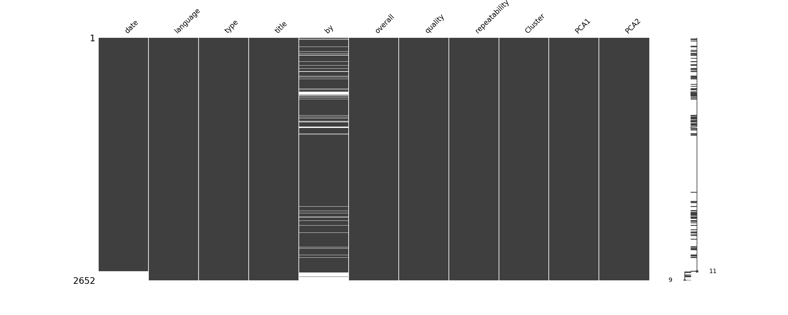
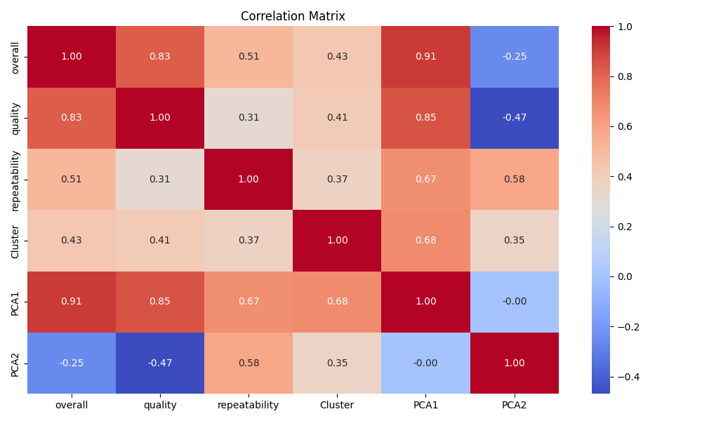
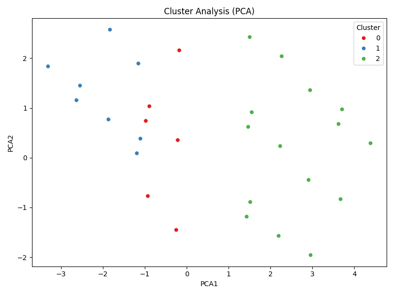

# Dataset Analysis of media.csv

## Dataset Summary
- Shape of the dataset: (2652, 8)
- Columns: date, language, type, title, by, overall, quality, repeatability
- Data types:
{'date': dtype('O'), 'language': dtype('O'), 'type': dtype('O'), 'title': dtype('O'), 'by': dtype('O'), 'overall': dtype('int64'), 'quality': dtype('int64'), 'repeatability': dtype('int64')}
- Descriptive statistics:
{'overall': {'count': 2652.0, 'mean': 3.0475113122171944, 'std': 0.7621797580962717, 'min': 1.0, '25%': 3.0, '50%': 3.0, '75%': 3.0, 'max': 5.0}, 'quality': {'count': 2652.0, 'mean': 3.2092760180995477, 'std': 0.7967426636666686, 'min': 1.0, '25%': 3.0, '50%': 3.0, '75%': 4.0, 'max': 5.0}, 'repeatability': {'count': 2652.0, 'mean': 1.4947209653092006, 'std': 0.598289430580212, 'min': 1.0, '25%': 1.0, '50%': 1.0, '75%': 2.0, 'max': 3.0}}
- Missing values per column:
{'date': 0, 'language': 0, 'type': 0, 'title': 0, 'by': 0, 'overall': 0, 'quality': 0, 'repeatability': 0}

## Outlier Detection
Outliers detected in each numeric column (Z-score > 3):
{'overall': 0, 'quality': 0, 'repeatability': 0}

## Correlation Analysis
Correlation Matrix:
{'overall': {'overall': 1.0, 'quality': 0.8259352331454309, 'repeatability': 0.5126000083900123}, 'quality': {'overall': 0.8259352331454309, 'quality': 1.0, 'repeatability': 0.31212651153886395}, 'repeatability': {'overall': 0.5126000083900123, 'quality': 0.31212651153886395, 'repeatability': 1.0}}

## Dataset Analysis Story
In a modest dataset of 2,652 records and 8 columns, we dive deep into the world of ratings, reviews, and evaluations. Each row tells the story of a specific interaction, marked by the date it occurred, the language it was communicated in, the type of content reviewed, the title of this content, the reviewer’s identity, and three numerical assessments: overall rating, quality, and repeatability.

### The Numbers Speak

As we first examine the descriptive statistics, we see an intriguing pattern emerging from our numerical assessments.

- **Overall Ratings**: The overall mean rating stands at approximately 3.05, indicating that, on average, reviewers are leaning slightly towards the 'satisfactory' side of the rating scale (1 being the lowest and 5 the highest). The standard deviation of 0.76 suggests moderate variability in these ratings, though a significant 50% of reviewers have rated their experiences between 3 and 5. These findings hint at a possibly skewed distribution, revealing a user base that is either pleasantly surprised or mildly disappointed, yet contented overall.

- **Quality Ratings**: A higher mean quality rating of about 3.21 further enhances the narrative that while users may feel their overall experience is mediocre, they recognize the inherent quality of the content. With a standard deviation of approximately 0.80, it tells us that some reviewers have experienced notably high-quality content that fuels their overall experience, while others have rated it much lower—a classic case of varied tastes.

- **Repeatability Ratings**: Representing the likelihood of the reviewer engaging with the content again, the repeatability rating reveals an intriguing motive. The mean at about 1.49, with most values clustering around 1—indicating 'not repeatable'—hints that while viewers may find some worth in the content, many are not particularly motivated to revisit it. This divergence in acceptance calls for deeper investigation to understand viewer expectations and what deters repeat visits.

### Absentee Outliers

A noteworthy aspect of our dataset is the absence of outliers across all three numerical ratings. This rare occurrence usually removes the noise from the analysis, lending greater confidence to our findings. The data curves smoothly, steering clear from any extreme values that could skew the averages in a significant direction. It suggests a uniformity of user experience—nobody seems to have had a wholly alienated or exceptionally euphoric rating that could disturb the trend.

### Chime and Correlation

Let's venture into how these ratings relate to each other. Our correlation matrix displays the robust connections between dimensions:
- The correlation between **overall** and **quality** ratings stands at a strong 0.83, indicating that the perceived overall experience greatly depends on how reviewers gauge the quality of content. Essentially, high-quality material enriches the overall satisfaction.
- The **overall** rating also shows a moderate correlation with **repeatability** (0.51), suggesting that when reviewers are happier with their experiences, they are more likely to consider returning. However, the weaker correlation of quality to repeatability (0.31) indicates that quality alone doesn't guarantee a revisit, possibly suggesting external factors influencing the decision.

### Recommendations and Further Analysis

As we unfurl the insights from our dataset, a few paths emerge for further exploration:

1. **Deeper Qualitative Analysis**: It might be beneficial to explore the reasons behind the quality and repeatability ratings. With several non-numeric attributes such as 'type' and 'title', textual analysis could lend deeper context and guidance. Surveys or in-depth interviews could provide qualitative data to enrich numerical findings.

2. **Segmenting User Behavior**: Consider performing cluster analysis to uncover distinct segments within the dataset based on language preferences, reviewer identities, or types of content reviewed. This could pinpoint targeted strategies to improve repeatability across different user groups.

3. **Enhancing Content Strategy**: Since the quality correlates strongly with overall ratings, investing in enhancing quality—through better curation or staff training—could have positive ripple effects on overall satisfaction and revisit likelihood. 

In conclusion, this dataset unfurls a mosaic of user engagement, revealing a group of moderately satisfied viewers recognizing quality but hesitant towards repeated exposure. By delving deeper into the nuances of these ratings, we can sculpt a more engaging ecosystem that caters to user preferences and encourages loyalty. This is the story told by our dataset, a reflection of expectations, experiences, and the path towards improvement—a narrative rich with potential and insight.

## Visualizations

