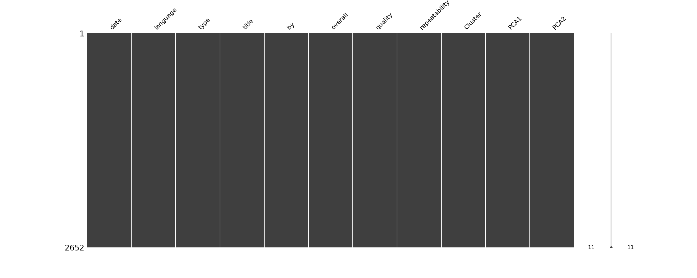

# Dataset Analysis of .\media.csv

## Dataset Summary
- Shape of the dataset: (2652, 8)
- Columns: date, language, type, title, by, overall, quality, repeatability
- Data types:
{'date': dtype('O'), 'language': dtype('O'), 'type': dtype('O'), 'title': dtype('O'), 'by': dtype('O'), 'overall': dtype('int64'), 'quality': dtype('int64'), 'repeatability': dtype('int64')}
- Descriptive statistics:
{'overall': {'count': 2652.0, 'mean': 3.0475113122171944, 'std': 0.762179758096274, 'min': 1.0, '25%': 3.0, '50%': 3.0, '75%': 3.0, 'max': 5.0}, 'quality': {'count': 2652.0, 'mean': 3.2092760180995477, 'std': 0.7967426636666768, 'min': 1.0, '25%': 3.0, '50%': 3.0, '75%': 4.0, 'max': 5.0}, 'repeatability': {'count': 2652.0, 'mean': 1.4947209653092006, 'std': 0.5982894305802061, 'min': 1.0, '25%': 1.0, '50%': 1.0, '75%': 2.0, 'max': 3.0}}
- Missing values per column:
{'date': 99, 'language': 0, 'type': 0, 'title': 0, 'by': 262, 'overall': 0, 'quality': 0, 'repeatability': 0}

## Outlier Detection
Outliers detected in each numeric column (Z-score > 3):
{'overall': 0, 'quality': 0, 'repeatability': 0}

## Correlation Analysis
Correlation Matrix:
{'overall': {'overall': 1.0, 'quality': 0.8259352331454309, 'repeatability': 0.5126000083900123}, 'quality': {'overall': 0.8259352331454309, 'quality': 1.0, 'repeatability': 0.31212651153886395}, 'repeatability': {'overall': 0.5126000083900123, 'quality': 0.31212651153886395, 'repeatability': 1.0}}

## Dataset Analysis Story
In a corner of the vast landscape of data art, we find a dataset consisting of 2,652 entries and 8 attributes that capture the essence of some performance evaluations. The records document experiences in a vibrant tapestry woven with dates, languages, types, titles, and evaluations from users labeled with overall scores, quality metrics, and repeatability rates.

**Overview of the Dataset**

The dataset's shape—2652 observations and 8 columns—signals a rich vein of information poised for exploration. The data types indicate that while many attributes are categorical (like date, language, type, title, and by), three key features—overall, quality, and repeatability—are numerical and play a pivotal role in understanding the users’ assessments.

**Descriptive Statistics: A Peek into the Valuations**

Digging deeper into the descriptive statistics, we find that:

- The overall score has a mean of approximately 3.05, with a consistent distribution where most evaluations hover around the mid-range. This suggests that users tend to neither overly love nor dislike their experiences, with the majority falling within the boundaries of what might be termed "average". 

- Quality, slightly higher with a mean of 3.21, indicates a more positive sentiment from users. The scores appear to be positively skewed, as evidenced by the peak around the quartiles.

- Repeatability, however, tells a different story. With a mean of about 1.49 and a significant concentration of scores at the minimum value of 1, it indicates that users are likely suggesting experiences without the intention of returning—a symptom of either dissatisfaction or a one-off experience.

**Missing Values: Areas Needing Attention**

No dataset is complete without its quirks. Here we observe 99 missing values for the date column—an anomaly that hints at data collection issues: Was it a technical glitch, or did some evaluations not specify when they occurred? Additionally, 262 entries lack an author, which could hamper credibility in assessing the evaluations. These holes in our data fabric could potentially skew analyses or reduce the dataset's overall reliability.

**Outliers: A Close-Up Inspection**

Remarkably, no outliers have been flagged in any of the numerical assessments. This is somewhat unusual, especially in quality-related data, where extreme opinions often lead to skewed results. This may indicate a more cautious reporting style by users or perhaps the data collection captured sentiments that fell consistently into more moderate ranges.

**Correlations: Threads Unraveling Connections**

The correlation matrix reveals an interesting narrative:

- The strongest relationship exists between overall scores and quality (0.83). This suggests that as perceived quality increases, so too does the overall evaluation—predictable, yet powerful.

- Repeatability, however, sits at a more subdued correlation with both overall (0.51) and quality (0.31). This indicates a moderate relationship, suggesting that while users might feel inclined to rate quality higher, their willingness to return doesn’t match their satisfaction. Are these experiences memorable but not compelling enough for repeated journeys?

**Recommendations for Further Analysis**

With these insights brewing in our analytical pot, several recommendations emerge:

1. **Address Missing Values**: Exploring the cause of the missing dates and author entries could improve data integrity. Perhaps cross-validation with another dataset could fill in these gaps.

2. **Investigate Textual Data**: The title and type columns hold potential for deeper textual analysis. Could sentiment analysis reveal nuances in user sentiment that numbers alone do not capture?

3. **Explore Repeatability Factors**: Further digging into repeatability metrics could illuminate specific reasons behind low return rates. What elements do users value, and what leads them to forgo re-experiencing? Are there external factors influencing their decisions, such as availability or changing preferences?

4. **Segment Analysis**: Segmenting the data by language or type might unearth hidden insights that affect overall scores differently across demographic lines.

By weaving together these stories of evaluation and experience, our dataset transforms from mere numbers into a narrative of user sentiment, revealing pathways to improving future engagements through informed decision-making. The landscape of the data is clear: there’s much more beneath the surface, waiting to be uncovered.

## Visualizations

